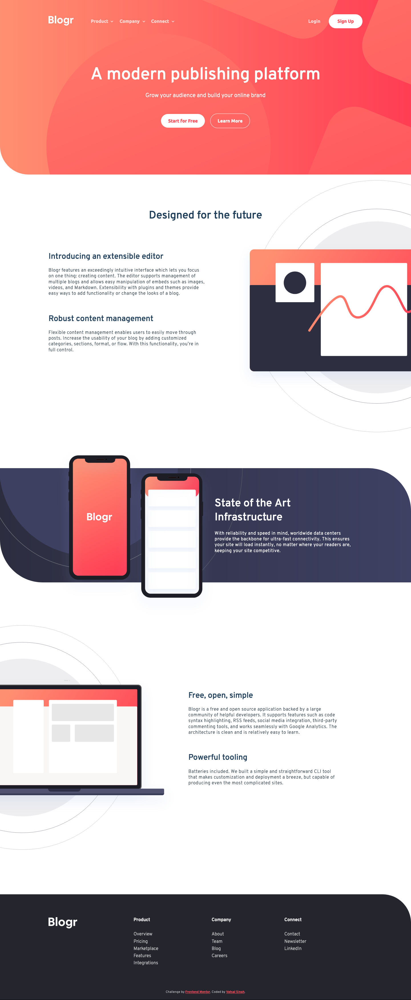
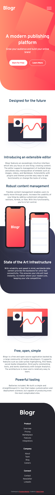
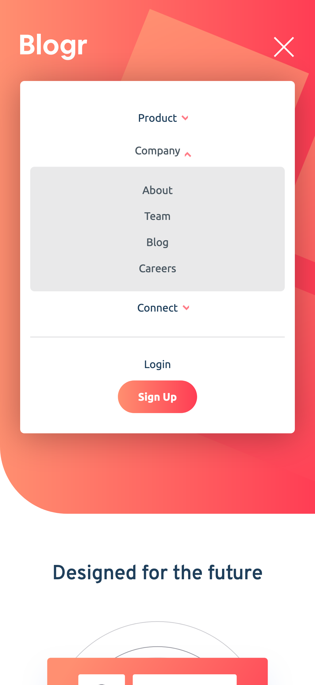

# Frontend Mentor - Blogr landing page solution

This is a solution to the [Blogr landing page challenge on Frontend Mentor](https://www.frontendmentor.io/challenges/blogr-landing-page-EX2RLAApP). Frontend Mentor challenges help you improve your coding skills by building realistic projects.

## Table of contents

- [Overview](#overview)
  - [The challenge](#the-challenge)
  - [Screenshot](#screenshot)
  - [Links](#links)
- [My process](#my-process)
  - [Built with](#built-with)
  - [What I learned](#what-i-learned)
  - [Continued development](#continued-development)
  - [Useful resources](#useful-resources)
- [Author](#author)
- [Acknowledgments](#acknowledgments)

## Overview

### The challenge

Users should be able to:

- View the optimal layout for the site depending on their device's screen size
- See hover states for all interactive elements on the page

### Screenshot





### Links

- Solution URL: [https://www.frontendmentor.io/solutions/blogr-landing-page-using-flexbox-and-sass-tp30RlQ56](https://www.frontendmentor.io/solutions/blogr-landing-page-using-flexbox-and-sass-tp30RlQ56)
- Live Site URL: [https://blogr-kv.netlify.app/](https://blogr-kv.netlify.app/)

## My process

### Built with

- Semantic HTML5 markup
- CSS custom properties
- Flexbox
- Desktop-first workflow
- [Sass](https://sass-lang.com/) - CSS extension language
- [jQuery](https://jquery.com/) - JS library

### What I learned

I've learned lot of stuff in this challenge:

- How to use Sass and organize code

```js
sass
├── abstract
│   ├── _mixins.scss
│   └── _variables.scss
├── base
│   ├── _base.scss
│   ├── _index.scss
│   ├── _reset.scss
│   ├── _typography.scss
│   └── _utilities.scss
├── components
│   ├── _attribution.scss
│   ├── _buttons.scss
│   ├── _dropdown.scss
│   ├── _index.scss
│   └── _navbar.scss
├── layouts
│   ├── _about.scss
│   ├── _banner.scss
│   ├── _features.scss
│   ├── _footer.scss
│   ├── _header.scss
│   └── _index.scss
└── main.scss
```

- How to make build process

```js
"scripts": {
  "start": "sass sass/main.scss css/style.css -w",
  "scss:compile": "sass sass/main.scss css/style.comp.css",
  "scss:postfix": "postcss css/style.comp.css --use autoprefixer -d css/",
  "scss:compress": "sass css/style.comp.css css/style.css --style compressed",
  "build": "npm-run-all scss:compile scss:postfix scss:compress"
}
```

- How to use package manager (NPM)

```js
"devDependencies": {
  "autoprefixer": "^10.3.7",
  "npm-run-all": "^4.1.5",
  "postcss-cli": "^9.0.1",
  "sass": "^1.43.2"
}
```

### Continued development

Technologies I want to learn:

- React
- Backend (Express)
- Data Structures
- Flutter & Dart

### Useful resources

- [MDN Docs](https://developer.mozilla.org/en-US/) - This is an amazing reference which helped me finally understand detailed concepts like data- attr, aria attr, input range etc.
- [W3Schools](https://www.w3schools.com/) - This is an amazing website for learning, I've learned abot semantic tags from here only and learned many important HTML elements. I'd recommend it to anyone still learning this concept.
- [CSS Responsive Images](https://imagekit.io/responsive-images/#chapter-4---srcset) - This reference helped me understand responsive images with great visiualization.

## Author

- Frontend Mentor - [@vatsalsinghkv](https://www.frontendmentor.io/profile/vatsalsinghkv)
- Github - [@vatsalsinghkv](https://github.com/vatsalsinghkv)
- Twitter - [@vatsalsinghkv](https://www.twitter.com/vatsalsinghkv)
- Instagram - [@vatsal.sing.hkv](https://www.instagram.com/vatsal.singh.kv)
- Facebook - [@vatsalsinghkv](https://www.facebook.com/vatsal.singh.kv)

## Acknowledgments

- [Changing :hover to touch/click for mobile devices](https://stackoverflow.com/a/22560108/14076424) - This answer on stackoverflow really helped me.
